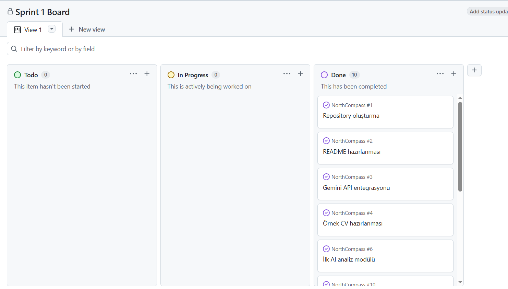

# Sprint 1 Raporu

## Sprint Bilgileri

* **Sprint:** Sprint 1
* **Proje:** NorthCompass
* **Sprint Amacı:** Projenin temel altyapısını oluşturmak, yapay zekâ entegrasyonunu gerçekleştirmek ve CV ile iş ilanını analiz edebilen ilk çalışabilir prototipi geliştirmek.

---

## Sprint Hedefleri

Sprint 1 kapsamında aşağıdaki hedefler belirlenmiştir ve tamamı başarıyla yerine getirilmiştir:

* GitHub proje organizasyon yapısının oluşturulması.
* Python modüler backend altyapısının hazırlanması.
* Google Gemini API entegrasyonunun güvenli şekilde gerçekleştirilmesi.
* Test süreçleri için örnek CV ve iş ilanı verilerinin yapılandırılması.
* Semantik analiz gerçekleştiren ilk yapay zekâ akışının geliştirilmesi.
* Proje yönetim ve teknik dökümantasyonunun hazırlanması.

---

## Sprint Board (Proje Takibi)

Sprint 1 sürecinde görevlerin planlanması, dağıtımı ve takibi GitHub Project Board üzerinde Kanban ilkelerine uygun olarak gerçekleştirilmiştir. İş listesindeki tüm görevler "Done" sütununa taşınarak süreç tamamlanmıştır.

---

## Daily Scrum Notları

### Gün 1
* Proje fikri netleştirildi ve ürün vizyonu oluşturuldu.
* GitHub merkezi deposu (repository) ve temel klasör yapısı kuruldu.

### Gün 2
* Projenin giriş noktası olan README ve bağımlılık yönetimini sağlayan requirements.txt dosyaları hazırlandı.
* Geliştirilecek modüler mimari katmanları tartışıldı ve belgelendi.

### Gün 3
* Google Gemini API entegrasyonu tamamlanarak utils/ai_analyzer.py modülü kodlandı.
* Test süreçlerinde girdi olarak kullanılmak üzere ham metin tabanlı örnek CV ve iş ilanı içerikleri üretildi.

### Gün 4
* Proje mimarisi gevşek bağlı (loosely coupled) modüller haline getirilerek utils/ dizini altına taşındı ve main.py akışı doğrulandı.
* Product Backlog, Roadmap, User Stories ve Architecture dokümanları nihai hallerine getirilerek sprint teslim paketi hazırlandı.

---

## Tamamlanan Çalışmalar

Sprint boyunca planlanan ve hayata geçirilen çalışmaların detaylı listesi şu şekildedir:

| Çalışma | Durum |
| :--- | :--- |
| GitHub deposunun oluşturulması | Tamamlandı |
| Proje klasör yapısının hazırlanması | Tamamlandı |
| Python geliştirme ortamının hazırlanması | Tamamlandı |
| Google Gemini API entegrasyonu | Tamamlandı |
| Örnek CV verisinin hazırlanmesi | Tamamlandı |
| Örnek iş ilanı verisinin hazırlanması | Tamamlandı |
| İlk AI analiz akışının geliştirilmesi | Tamamlandı |
| README dökümanının hazırlanması | Tamamlandı |
| Product Backlog dökümanının hazırlanması | Tamamlandı |
| User Stories dökümanının hazırlanması | Tamamlandı |
| System Architecture dökümanının hazırlanması | Tamamlandı |
| Roadmap dökümanının hazırlanması | Tamamlandı |

---

## Sprint Çıktısı (MVP)

Sprint 1 sonunda başarıyla ayağa kaldırılan ve terminal çıktısı alınan ilk prototip (Minimum Viable Product) aşağıdaki işlevleri gerçekleştirmektedir:

* Belirlenen dizindeki örnek CV dosyasını yapısal olarak okuyabilmektedir.
* Belirlenen dizindeki örnek iş ilanı metnini veri katmanına alabilmektedir.
* Güvenli API anahtarı yönetimiyle her iki metni semantik olarak Google Gemini modeline beslemektedir.
* Adayın profili ile pozisyon gereksinimleri arasındaki uyuma dair güçlü/zayıf yönleri içeren yapay zekâ analiz raporu üretebilmektedir.

---

## Sprint Review (Değerlendirme)

Sprint 1 planlamasına ve zaman çizelgesine tam uyum sağlanmıştır:

* Projenin sürdürülebilir, genişletilebilir ve modüler mimari altyapısı kurulmuştur.
* İlk fonksiyonel MVP başarıyla doğrulanmış ve terminal çıktısı kanıt olarak sunulmuştur.
* Google Gemini API entegrasyonu ile yapay zekâ yetenekleri sisteme kararlı bir şekilde dahil edilmiştir.
* Gelecek sprintlerde geliştirilecek modüller için ürün yol haritası (Roadmap) netleştirilmiştir.

---

## Sprint Retrospective

### İyi Gidenler
* Projenin temel mimarisi ve klasör yapısı oldukça temiz, modüler ve anlaşılır bir şekilde kurgulandı.
* Yapay zekâ entegrasyonu ve prompt şablonlarının optimizasyonu hedeflenen süreden daha kısa sürede tamamlandı.
* Dokümantasyon süreçleri çevik proje yönetimi standartlarına bağlı kalınarak eksiksiz yürütüldü.

### Geliştirilecek Noktalar ve Sonraki Sprint Hedefleri
* İlerleyen süreçlerde komut satırı arayüzü yerine kullanıcı deneyimini artıracak web tabanlı bir arayüz entegrasyonu planlanacaktır.
* ATS uyumluluk analizi, matematiksel eşleşme skoru ve eksik becerilerin tespiti gibi daha derinlemesine analiz algoritmaları mimariye dahil edilecektir.
* Kullanıcıların statik metinler yerine kendi dinamik CV dosyalarını doğrudan sisteme yükleyebileceği esnek dosya işleme altyapısı kurulacaktır.
